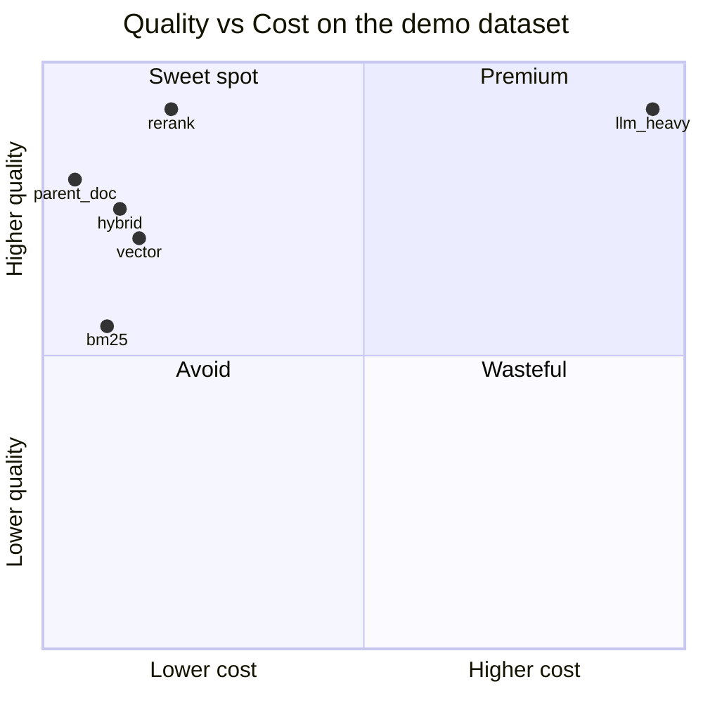
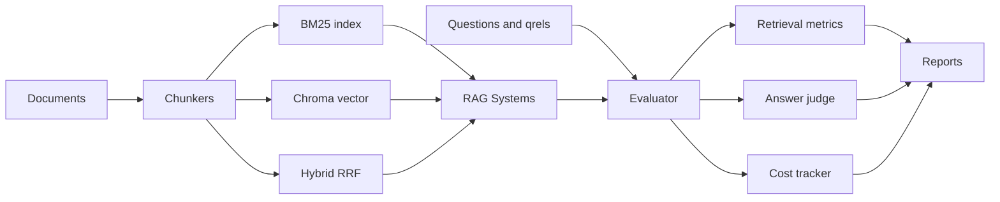

# RAGBench

[](https://github.com/alexandre0sheva/ragbench/actions/workflows/ci.yml)
[](https://www.python.org/downloads/)
[](LICENSE)
[](https://github.com/astral-sh/ruff)
[](https://peps.python.org/pep-0561/)

**RAGBench is an evaluation-first benchmark harness for Retrieval-Augmented Generation.** Run six retrieval architectures — BM25, vector, hybrid, rerank, parent-document, LLM-heavy — against the same dataset and questions. Get a leaderboard of retrieval quality, answer quality, faithfulness, latency, and cost.

It is not a demo chatbot. It answers a single question: *which RAG approach gives the best quality, cost, and speed tradeoff for **my** documents and **my** questions?*

## Results at a glance

Latest run on the bundled demo dataset (16 documents, 30 questions across 10 categories):

| System | Recall@5 | MRR@10 | nDCG@10 | Answer | Faithfulness | $/Q | Latency | Best for |
| --- | ---: | ---: | ---: | ---: | ---: | ---: | ---: | --- |
| `bm25` | 0.856 | 0.841 | 0.823 | 4.76 | 4.87 | $0.00041 | 1418 ms | Cheap lexical baseline |
| `vector` | 0.878 | 0.822 | 0.816 | 4.91 | 5.00 | $0.00042 | 1465 ms | Semantic baseline |
| `hybrid` | 0.856 | 0.867 | 0.837 | 4.79 | 4.98 | $0.00041 | 1449 ms | Balanced lexical + semantic |
| `rerank` | 0.867 | **0.878** | **0.850** | 4.84 | 4.98 | $0.00043 | 1416 ms | Higher precision retrieval |
| `parent_doc` | 0.867 | 0.822 | 0.815 | 4.89 | 4.98 | **$0.00038** | **1361 ms** | Small-to-big context |
| `llm_heavy` | 0.867 | 0.878 | 0.850 | 4.90 | 4.98 | $0.00102 | 3083 ms | Quality-oriented expensive |

**Takeaways from this run:**

- `rerank` achieves the best ranking quality (MRR, nDCG) at near-baseline cost.
- `llm_heavy` matches `rerank` on quality but costs **2.5×** more and is **2.2×** slower — the extra LLM hops do not pay off on this dataset.
- `parent_doc` is the cost / latency winner with answer quality nearly tied with the leaders.
- Bring your own dataset to find out which one wins on yours.



## Quickstart

```bash
pip install -e .
ragbench demo
ragbench compare --config configs/all.yaml
```

Without an `OPENAI_API_KEY`, RAGBench runs in **mock mode** — deterministic hashing embeddings, mock LLM, heuristic judge — so reviewers can exercise the full pipeline immediately. With a key set in your shell or `.env`, it switches to OpenAI embeddings, generation, and LLM-as-a-judge.

```bash
# strong default baseline only
ragbench run --config configs/recommended.yaml

# inspect a custom dataset before running
ragbench inspect-dataset --docs my_dataset/docs \
    --questions my_dataset/questions.jsonl \
    --qrels my_dataset/qrels.jsonl
```

## Architecture



## Compared systems

| System | Description | Typical use |
| --- | --- | --- |
| `bm25` | Lexical BM25 over chunks | Cheap baseline and exact-term matching |
| `vector` | Chroma-backed embedding search with cosine similarity | Semantic baseline |
| `hybrid` | BM25 + vector with Reciprocal Rank Fusion | Balanced lexical + semantic retrieval |
| `rerank` | Vector retrieval followed by reranking | Higher precision context selection |
| `parent_doc` | Retrieve small child chunks, answer from larger parent chunks | Better answer context with precise retrieval |
| `llm_heavy` | LLM-driven ingestion metadata, query rewrite, and reranking | Higher-cost quality-oriented experiments |

## Metrics

Retrieval is evaluated at the **document level** because chunks are generated dynamically by each system. RAGBench reports:

- **Retrieval:** Recall@K, Precision@K, Hit@K, MRR@K, nDCG@K (graded if qrels are present).
- **Answer:** Correctness, Faithfulness, Completeness, Relevance, Citation quality (LLM-as-judge or heuristic in mock mode).
- **Operational:** Ingestion / query / judge cost, average latency, wall time, failure-type distribution.

## Outputs

Each run writes a timestamped directory containing `leaderboard.md`, `report.html`, `metrics_summary.csv`, `per_question_results.jsonl`, `retrieval_metrics.csv`, `answer_metrics.csv`, `cost_breakdown.csv`, `failures.md`, `qrels_audit.md`, `system_runtime.csv`, and `run_summary.json`.

`qrels_audit.md` is a dataset-quality aid: it surfaces cases where a system was judged to answer well but retrieved documents were not labeled relevant. Treat those rows as candidates for human review, not automatic ground-truth edits.

## Bring your own dataset

```text
my_dataset/
  docs/
    policy.md
    product_notes.md
  questions.jsonl
  qrels.jsonl   # optional — graded relevance
```

Point a config at it (copy any of `configs/*.yaml`) and run `ragbench compare --config my_config.yaml`.

See [docs/dataset-format.md](docs/dataset-format.md) for the schema reference.

## Parallel runs

```yaml
evaluation:
  max_workers: 4
```

Or via CLI: `ragbench compare --config configs/all.yaml --max-workers 8`. Higher values reduce wall time for live LLM runs but may hit provider rate limits. Use `--max-workers 1` for fully sequential execution.

## Documentation

- [Configuration guide](docs/configuration.md)
- [Dataset format](docs/dataset-format.md)
- [Adding a new RAG system](docs/extending.md)
- [GitHub setup](docs/github-setup.md)
- [Release checklist](docs/release-checklist.md)

## Cost warning

Pricing constants in `src/ragbench/models/cost.py` are approximate. Defaults use `gpt-5.4-nano` at $0.20 / 1M input tokens and $1.25 / 1M output tokens. `gpt-5.4-mini` is registered for the LLM-heavy config at $0.75 / 1M input and $4.50 / 1M output. Update the registry before using RAGBench for financial forecasting. The `llm_heavy` system can be materially more expensive because it uses LLM calls during ingestion, query rewrite, reranking, and judging.

## Roadmap

- Persistent vector store adapters (Postgres / pgvector, Qdrant)
- Cross-encoder reranker integration
- Bootstrap confidence intervals for metric comparisons
- Web dashboard for comparing historical runs

## License

[MIT](LICENSE) — see [CONTRIBUTING.md](CONTRIBUTING.md) and [CODE_OF_CONDUCT.md](CODE_OF_CONDUCT.md) before opening a PR.
