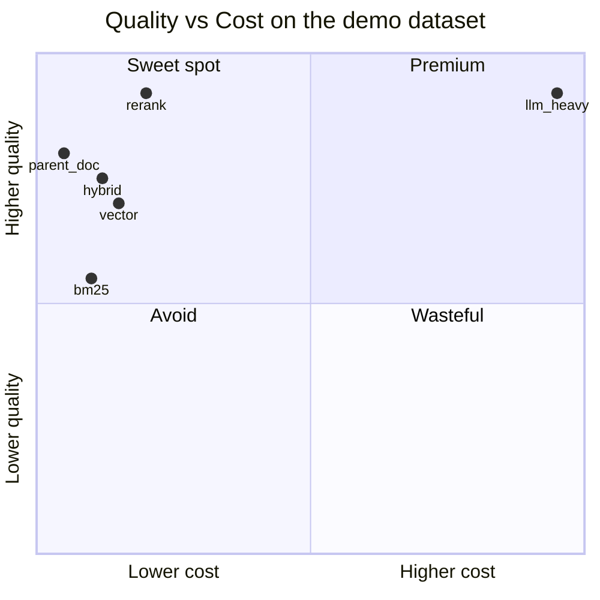
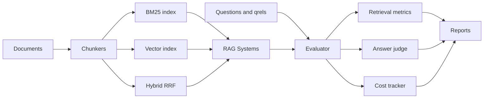

# RAGBench

[](https://github.com/alexandre0sheva/ragbench/actions/workflows/ci.yml)
[](https://www.python.org/downloads/)
[](LICENSE)
[](https://github.com/astral-sh/ruff)
[](https://peps.python.org/pep-0561/)

**RAGBench is an evaluation-first benchmark harness for Retrieval-Augmented Generation.** Run many retrieval architectures — lexical, vector, hybrid, reranked, parent-document, HyDE, LLM-driven and more (see [docs/systems.md](docs/systems.md)) — against the same dataset and questions. Get a leaderboard of retrieval quality, answer quality, faithfulness, latency, and cost.

It is not a demo chatbot. It answers a single question: *which RAG approach gives the best quality, cost, and speed tradeoff for **my** documents and **my** questions?*

## Results at a glance

Example live run on the bundled demo dataset (numbers below are from a v0.1.0 run with the six original systems on the earlier 45-question dataset; the bundled dataset now has 60 documents and 163 questions across 12 categories — run `ragbench compare --config configs/all.yaml` to produce fresh numbers for all eight systems):

| System | Recall@5 | MRR@10 | nDCG@10 | Answer | Faithfulness | $/Q | Latency | Best for |
| --- | ---: | ---: | ---: | ---: | ---: | ---: | ---: | --- |
| `bm25` | 0.856 | 0.841 | 0.823 | 4.76 | 4.87 | $0.00041 | 1418 ms | Cheap lexical baseline |
| `vector` | 0.878 | 0.822 | 0.816 | 4.91 | 5.00 | $0.00042 | 1465 ms | Semantic baseline |
| `hybrid` | 0.856 | 0.867 | 0.837 | 4.79 | 4.98 | $0.00041 | 1449 ms | Balanced lexical + semantic |
| `rerank` | 0.867 | **0.878** | **0.850** | 4.84 | 4.98 | $0.00043 | 1416 ms | Higher precision retrieval |
| `parent_doc` | 0.867 | 0.822 | 0.815 | 4.89 | 4.98 | **$0.00038** | **1361 ms** | Small-to-big context |
| `llm_heavy` | 0.867 | 0.878 | 0.850 | 4.90 | 4.98 | $0.00102 | 3083 ms | Quality-oriented expensive |

**Takeaways from this run:**

- `rerank` achieves the best ranking quality (MRR, nDCG) at near-baseline cost.
- `llm_heavy` matches `rerank` on quality but costs **2.5×** more and is **2.2×** slower — the extra LLM hops do not pay off on this dataset.
- `parent_doc` is the cost / latency winner with answer quality nearly tied with the leaders.
- Bring your own dataset to find out which one wins on yours.


```mermaid
quadrantChart
    title Quality vs Cost on the demo dataset
    x-axis Lower cost --> Higher cost
    y-axis Lower quality --> Higher quality
    quadrant-1 Premium
    quadrant-2 Sweet spot
    quadrant-3 Avoid
    quadrant-4 Wasteful
    bm25: [0.10, 0.55]
    vector: [0.15, 0.70]
    hybrid: [0.12, 0.75]
    rerank: [0.20, 0.92]
    parent_doc: [0.05, 0.80]
    llm_heavy: [0.95, 0.92]
```

## Quickstart

```bash
pip install -e .
ragbench demo
ragbench compare --config configs/all.yaml
```

No config yet? `ragbench compare --preset quick --docs my_docs/ --questions my_questions.jsonl` runs three strong baselines on your data (`standard`, `thorough` and `agentic` add more), and `ragbench estimate --config configs/all.yaml` projects the cost first; see [presets, sweeps and budgets](docs/configuration.md#sweeps).

Every run ends with a **recommendation**: which system to deploy under your constraints, the systems that are statistically tied with it, and a ready-to-run `winner.yaml` (`ragbench recommend --run results/<run> --max-cost 0.002` re-asks it with other constraints; see [methodology](docs/methodology.md#selection)).

Without an `OPENAI_API_KEY`, RAGBench runs in **mock mode** — deterministic hashing embeddings, mock LLM, heuristic judge — so reviewers can exercise the full pipeline immediately. With a key set in your shell or `.env`, it switches to real embeddings, generation, and LLM-as-a-judge. Models are `provider:model` refs (OpenAI, Claude via `pip install 'ragbench[anthropic]'`, any OpenAI-compatible server such as Ollama or vLLM, local `sentence-transformers` embeddings via `ragbench[local]`, cross-encoder reranking via `ragbench[rerank]`). The vector backend is exact NumPy by default; `ragbench[chroma]`, `ragbench[faiss]` and `ragbench[qdrant]` add others; see [configuration](docs/configuration.md#providers--model-refs).

```bash
# strong default baseline only
ragbench run --config configs/recommended.yaml

# inspect a custom dataset before running
ragbench inspect-dataset --docs my_dataset/docs \
    --questions my_dataset/questions.jsonl \
    --qrels my_dataset/qrels.jsonl
```

## Architecture


```mermaid
flowchart LR
    A[Documents] --> B[Chunkers]
    B --> S1[BM25 index]
    B --> S2[Vector index]
    B --> S3[Hybrid RRF]
    S1 --> D[RAG Systems]
    S2 --> D
    S3 --> D
    Q[Questions and qrels] --> E[Evaluator]
    D --> E
    E --> M1[Retrieval metrics]
    E --> M2[Answer judge]
    E --> M3[Cost tracker]
    M1 --> R[Reports]
    M2 --> R
    M3 --> R
```

## Compared systems

<!-- systems:start -->
| System | Description | Typical use |
| --- | --- | --- |
| `bm25` | Lexical BM25 over chunks | Cheap baseline and exact-term matching |
| `hybrid` | BM25 + vector search fused with (optionally weighted) Reciprocal Rank Fusion | Balanced lexical + semantic retrieval |
| `hybrid_rerank` | Hybrid BM25 + vector RRF retrieval followed by a reranking pass | Recall of hybrid plus rerank precision |
| `no_retrieval` | The model answers from its own knowledge with no documents at all (the floor baseline) | Showing how much retrieval helps and how often the model makes things up without it |
| `parent_doc` | Retrieve small child chunks, answer from their larger parent chunks | Better answer context with precise retrieval |
| `rerank` | Vector retrieval followed by a reranking pass | Higher precision context selection |
| `sentence_window` | Search single sentences, then hand the generator each matched sentence with the sentences around it | Precise matching with enough surrounding text to answer from |
| `vector` | Embedding search with cosine similarity over a pluggable vector backend (exact NumPy by default) | Semantic baseline |
| `decompose` | The LLM splits a complex question into sub-questions; each is searched (optionally in sequence, feeding earlier answers forward), then one answer is synthesized from all the evidence | Multi-part, comparison and multi-hop questions |
| `hyde` | Hypothetical Document Embeddings: the LLM writes a hypothetical answer used as the search probe | Short or vaguely-worded questions |
| `rag_fusion` | The LLM writes alternative queries; each is searched (hybrid or vector) and the rankings are merged with Reciprocal Rank Fusion | Questions worded differently from the documents |
| `contextual` | An LLM situates each chunk within its document at ingestion; the context is embedded and BM25-indexed with the chunk, then hybrid RRF retrieval | Corpora where chunks lose their meaning out of context (many similar documents, pronouns, section-relative facts) |
| `hierarchical` | Choose documents first from LLM-written summaries and titles, then retrieve chunks only inside the chosen documents | "Which document?" questions and corpora too large to search chunk by chunk |
| `adaptive` | Routes each question to the best of several configured pipelines (exact identifiers to BM25, comparisons to decomposition, calculations to a tool agent, the rest to the default) | Mixed workloads where no single architecture is best for every question |
| `full_context` | Puts whole documents (the whole corpus when it fits) in the prompt, most relevant first by BM25, up to a token budget (the ceiling baseline: do you need retrieval at all?) | Small corpora, and measuring how much a retrieval pipeline loses against reading everything |
| `agent_search` | A function-calling agent that searches the corpus and calls its configured tools (calculator, date_calc, corpus_grep, ...), then writes the cited answer | Questions that need computation, exact lookups, or several searches |
| `corrective` | Retrieve, grade each chunk with the LLM, and when too little is relevant rewrite the query and widen the search; optional answer self-check | Corpora where the first search often misses and a bad context should be noticed rather than answered from |
| `grep_agent` | An index-free agent: it lists, greps and reads the raw documents with tools. No chunking, no embeddings, no vector store | Small or exact-match-heavy corpora, and testing whether you need retrieval infrastructure at all |
| `iterative` | Search, ask the LLM what is known and what is missing, search for the missing part, and repeat until it says it is done or the hop limit is reached | Multi-hop questions whose second search depends on what the first one found |
| `llm_heavy` | LLM-driven ingestion metadata, query rewriting, and reranking | Higher-cost, quality-oriented experiments |
<!-- systems:end -->

All systems implement the same `BaseRAGSystem` interface and run on any user-supplied dataset — point any config at your own `docs/` + `questions.jsonl` and every approach above is directly comparable on your data. Options for each system are documented in [docs/systems.md](docs/systems.md).

## Metrics

RAGBench scores retrieval (Recall, MRR, nDCG at the document level), the context the generator actually saw, answer quality (LLM judge, token F1, exact match, abstention) and operations (cost, latency, steps, tool calls). Leaderboards show 95% confidence intervals, a paired significance test against a baseline and the Pareto-optimal systems, so a 0.02 gap on 50 questions is not presented as a winner. Definitions, the judge's design and its biases, cost accounting and limitations are in [docs/methodology.md](docs/methodology.md).

## Outputs

While a benchmark runs, the CLI shows live per-system progress (ingestion, then a question-by-question bar) and finishes with a leaderboard table in the terminal, with the best value in each column highlighted.

Each run writes a timestamped directory containing `leaderboard.md`, `report.html`, `metrics_summary.csv`, `per_question_results.jsonl`, `retrieval_metrics.csv`, `answer_metrics.csv`, `cost_breakdown.csv`, `failures.md`, `qrels_audit.md`, `system_runtime.csv`, `significance.csv`, `stats.json`, `pareto.json`, `recommendation.md` / `recommendation.json`, `winner.yaml`, `run_summary.json`, and `run_manifest.json` (versions, git commit, config/dataset hashes).

`report.html` is a self-contained page (no CDN, works offline) with winner summary cards, a sortable leaderboard, comparison bar charts, per-category quality, cost breakdown, and failure analysis. It adapts to light and dark mode.

`qrels_audit.md` is a dataset-quality aid: it surfaces cases where a system was judged to answer well but retrieved documents were not labeled relevant. Treat those rows as candidates for human review, not automatic ground-truth edits.

## Bring your own dataset

```text
my_dataset/
  docs/
    policy.md
    contract.pdf
    product_notes.md
  questions.jsonl
  qrels.jsonl   # optional — graded relevance
```

Documents can be `.md`, `.txt`, `.rst`, `.html`, `.pdf`, `.docx`, `.csv`/`.tsv` or `.json`/`.jsonl` (PDF and Word need the optional extras `ragbench[pdf]` and `ragbench[docx]`); see [dataset-format.md](docs/dataset-format.md) for formats, ignore rules and error handling. Point a config at the dataset (copy any of `configs/*.yaml`) and run `ragbench compare --config my_config.yaml`.

Before running, sanity-check the dataset — `inspect-dataset` validates qrels coverage, missing document references, duplicate ids, and empty documents:

```bash
ragbench inspect-dataset --docs my_dataset/docs \
    --questions my_dataset/questions.jsonl \
    --qrels my_dataset/qrels.jsonl
```

See [docs/dataset-format.md](docs/dataset-format.md) for the schema reference.

## Parallel runs

Systems, questions, ingestion and embedding batches run concurrently (`--system-workers`, `--max-workers`; results are identical to a sequential run), optional rate limits keep you under provider quotas, and live runs re-time a few questions one at a time for clean latency. See [Concurrency](docs/configuration.md#concurrency).

## Caching

Live runs cache paid calls on disk (`.ragbench_cache/`), so re-running an unchanged benchmark costs almost nothing, and systems in one run share corpus embeddings. A cache hit is still charged at standalone prices, so `$/Q` stays comparable ([why](docs/methodology.md#cost-accounting)). See [Caching](docs/configuration.md#caching) for the rules and `ragbench cache stats|clear`.

## Documentation

- [Configuration guide](docs/configuration.md)
- [RAG systems and their options](docs/systems.md) *(generated)*
- [Command-line reference](docs/cli.md) *(generated)*
- [Dataset format](docs/dataset-format.md)
- [Methodology: metrics, judge, cost accounting, limitations](docs/methodology.md)
- [Extending RAGBench](docs/extending.md)
- [GitHub setup](docs/github-setup.md)
- [Release checklist](docs/release-checklist.md)

## Cost warning

Live runs spend real money, and LLM-heavy and agentic systems spend the most. Prices are approximate and overridable; see [Cost accounting](docs/methodology.md#cost-accounting) and [`pricing:`](docs/configuration.md#pricing).

## Roadmap

- Persistent vector store adapters (Postgres / pgvector, Qdrant)
- Web dashboard for comparing historical runs

## License

[MIT](LICENSE) — see [CONTRIBUTING.md](CONTRIBUTING.md) and [CODE_OF_CONDUCT.md](CODE_OF_CONDUCT.md) before opening a PR.
