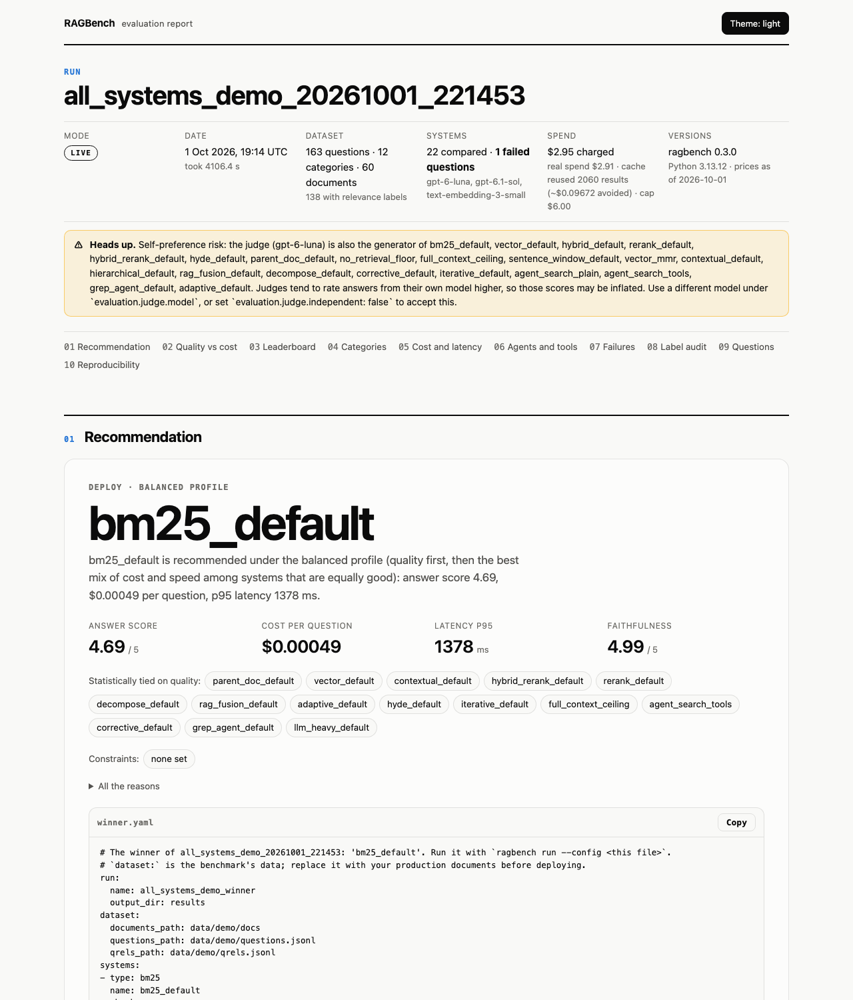
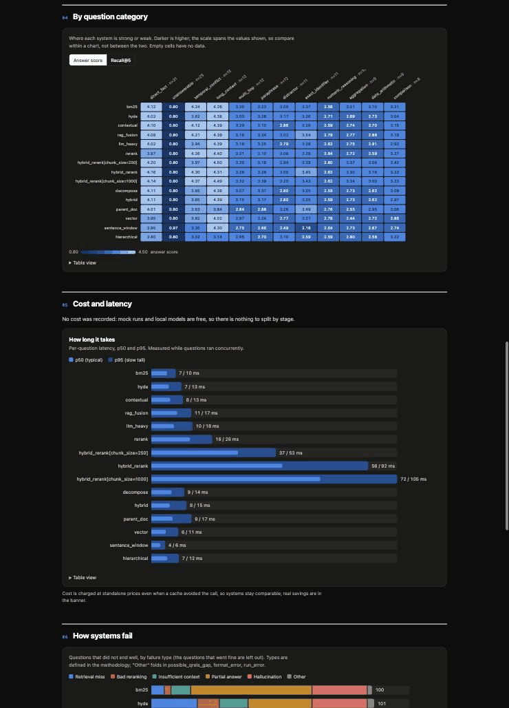

# RAGBench

[](https://github.com/alexandre0sheva/ragbench/actions/workflows/ci.yml)
[](https://www.python.org/downloads/)
[](LICENSE)
[](https://github.com/astral-sh/ruff)
[](https://peps.python.org/pep-0561/)

**RAGBench tells you which retrieval-augmented generation setup to deploy for *your* documents and *your* questions.** It runs many architectures (lexical, vector, hybrid, reranked, LLM-driven, tool-using agents and more) on the same data, scores retrieval, answers, cost and latency with confidence intervals, and ends with a recommendation and a runnable `winner.yaml`.

It is not a demo chatbot, and it needs no API key to try: without one it runs on deterministic mock models so you can see the whole pipeline first.

## Quickstart

```bash
pip install -e .
ragbench auto --docs ./my_docs --mock     # drop --mock for a real run: it estimates the cost and asks before spending
```

`auto` profiles your documents, writes questions from them if you have none (flagged `needs_review`; bring your own with `--questions`), runs a preset of systems, and prints the recommended one with the paths of `winner.yaml`, `report.html` and `recommendation.md`. If it stops, `ragbench auto --resume RUN_DIR` continues without paying again. Prefer to write the config yourself? `ragbench init my_ds --docs ./my_docs` scaffolds one; `ragbench demo` and `ragbench run --config configs/all.yaml --mock` run the bundled demo.

Not sure which architecture to try first, or what to look at in the report? Start with [Choosing an architecture](docs/choosing-an-architecture.md).

## What you get

Each run writes one directory: a **recommendation** (which system to deploy under your constraints, the systems statistically tied with it, a runnable `winner.yaml`), a self-contained **`report.html`** (leaderboard with confidence whiskers, quality-against-cost chart, category heatmap, cost and latency by stage, failure types, and a drill-down into every question with the retrieved passages and the agent's steps), `leaderboard.md`, and the CSV and JSONL files all of it is built from. `ragbench report RUN` rebuilds any report from those files, `ragbench runs` lists past runs and `ragbench compare-runs A B` flags regressions.

<p>
  
  
</p>

`report.html` follows the OS theme, has a light/dark toggle, and works on a phone-sized screen.

### An example result

A live run of [`configs/all.yaml`](configs/all.yaml) on the bundled demo dataset (60 documents, 163 questions, 22 systems; `gpt-6-luna` generates and judges, `gpt-6.1-sol` for `llm_heavy`, `text-embedding-3-small`), run 1 Oct 2026 with ragbench 0.3.0 for about $2.91 of real API spend. Brackets are 95% bootstrap confidence intervals over the questions; the metrics are defined in the [methodology](docs/methodology.md).

| System | Recall@5 | Answer score | $ / question | p95 latency |
| --- | --- | --- | --- | --- |
| `no_retrieval_floor` | — | 1.54 [1.40, 1.68] | $0.00012 | 1093 ms |
| **`bm25_default`** (recommended) | 0.745 [0.681, 0.808] | 4.69 [4.55, 4.81] | $0.00049 | 1378 ms |
| `vector_default` | 0.790 [0.733, 0.847] | 4.67 [4.54, 4.79] | $0.00044 | 1637 ms |
| `hybrid_rerank_default` | 0.774 [0.713, 0.832] | 4.72 [4.59, 4.84] | $0.00053 | 2140 ms |
| `llm_heavy_default` | 0.790 [0.728, 0.848] | 4.72 [4.60, 4.82] | $0.00512 | 8055 ms |
| `full_context_ceiling` | 0.741 [0.676, 0.804] | 4.78 [4.70, 4.84] | $0.00280 | 2257 ms |
| `iterative_default` (agent) | 0.799 [0.742, 0.856] | 4.81 [4.71, 4.90] | $0.00057 | 3952 ms |
| `agent_search_tools` (agent) | 0.821 [0.767, 0.876] | 4.75 [4.63, 4.85] | $0.00082 | 5783 ms |
| `grep_agent_default` (agent) | 0.791 [0.736, 0.850] | 4.78 [4.69, 4.86] | $0.00109 | 9437 ms |

Nine of the 22 systems are shown; [the full example run](docs/example-run.md) has all of them, the per-category winners and the saved result files.

- **Retrieval is what matters most here.** Without it the model scores 1.54; `bm25_default` scores 3.15 points higher (95% CI +2.95 to +3.35) and wins on 159 of 163 questions.
- **Past that, quality did not separate the systems.** `bm25_default` and 15 others are statistically tied with the best answer score (`iterative_default`, 4.81) under a paired bootstrap with Holm correction; `bm25_default` is 0.12 lower (CI −0.27 to +0.01). So the recommendation fell to cost and latency: `bm25_default` costs $0.00049 per question, against up to $0.00512 for the tied systems.
- **How far to trust it.** This is a small, easy corpus (about 23k tokens) with a judge that is also the generator, so scores are probably inflated and the ranking may not carry over to yours (the report says so in its banner). OpenAI's content filter rejected one `rag_fusion_default` call; that question is excluded from its scores. Run it on your own documents with `ragbench auto`.

## Systems

<!-- systems:start -->
| System | Description | Typical use |
| --- | --- | --- |
| `bm25` | Lexical BM25 over chunks | Cheap baseline and exact-term matching |
| `hybrid` | BM25 + vector search fused with (optionally weighted) Reciprocal Rank Fusion | Balanced lexical + semantic retrieval |
| `hybrid_rerank` | Hybrid BM25 + vector RRF retrieval followed by a reranking pass | Recall of hybrid plus rerank precision |
| `no_retrieval` | The model answers from its own knowledge with no documents at all (the floor baseline) | Showing how much retrieval helps and how often the model makes things up without it |
| `parent_doc` | Retrieve small child chunks, answer from their larger parent chunks | Better answer context with precise retrieval |
| `rerank` | Vector retrieval followed by a reranking pass | Higher precision context selection |
| `sentence_window` | Search single sentences, then hand the generator each matched sentence with the sentences around it | Precise matching with enough surrounding text to answer from |
| `vector` | Embedding search with cosine similarity over a pluggable vector backend (exact NumPy by default) | Semantic baseline |
| `decompose` | The LLM splits a complex question into sub-questions; each is searched (optionally in sequence, feeding earlier answers forward), then one answer is synthesized from all the evidence | Multi-part, comparison and multi-hop questions |
| `hyde` | Hypothetical Document Embeddings: the LLM writes a hypothetical answer used as the search probe | Short or vaguely-worded questions |
| `rag_fusion` | The LLM writes alternative queries; each is searched (hybrid or vector) and the rankings are merged with Reciprocal Rank Fusion | Questions worded differently from the documents |
| `contextual` | An LLM situates each chunk within its document at ingestion; the context is embedded and BM25-indexed with the chunk, then hybrid RRF retrieval | Corpora where chunks lose their meaning out of context (many similar documents, pronouns, section-relative facts) |
| `hierarchical` | Choose documents first from LLM-written summaries and titles, then retrieve chunks only inside the chosen documents | "Which document?" questions and corpora too large to search chunk by chunk |
| `adaptive` | Routes each question to the best of several configured pipelines (exact identifiers to BM25, comparisons to decomposition, calculations to a tool agent, the rest to the default) | Mixed workloads where no single architecture is best for every question |
| `full_context` | Puts whole documents (the whole corpus when it fits) in the prompt, most relevant first by BM25, up to a token budget (the ceiling baseline: do you need retrieval at all?) | Small corpora, and measuring how much a retrieval pipeline loses against reading everything |
| `agent_search` | A function-calling agent that searches the corpus and calls its configured tools (calculator, date_calc, corpus_grep, ...), then writes the cited answer | Questions that need computation, exact lookups, or several searches |
| `corrective` | Retrieve, grade each chunk with the LLM, and when too little is relevant rewrite the query and widen the search; optional answer self-check | Corpora where the first search often misses and a bad context should be noticed rather than answered from |
| `grep_agent` | An index-free agent: it lists, greps and reads the raw documents with tools. No chunking, no embeddings, no vector store | Small or exact-match-heavy corpora, and testing whether you need retrieval infrastructure at all |
| `iterative` | Search, ask the LLM what is known and what is missing, search for the missing part, and repeat until it says it is done or the hop limit is reached | Multi-hop questions whose second search depends on what the first one found |
| `llm_heavy` | LLM-driven ingestion metadata, query rewriting, and reranking | Higher-cost, quality-oriented experiments |
<!-- systems:end -->

Every system implements the same interface and runs on any dataset. Options and trade-offs: [docs/systems.md](docs/systems.md).

## Documentation

- [Choosing an architecture](docs/choosing-an-architecture.md): which systems to try for your corpus, questions, budget and privacy needs, and how to read the result
- [Configuration](docs/configuration.md): config sections, presets, sweeps, budgets, caching, concurrency, model providers
- [Dataset format](docs/dataset-format.md): documents, questions, qrels, importers, generating questions and labels
- [Methodology](docs/methodology.md): metrics, the judge, statistics, cost accounting, how to read the report, limitations
- [System wiki](docs/system-wiki.md): how every system, chunker, reranker and agent works, with diagrams
- [Systems](docs/systems.md) and [tools](docs/tools.md) *(generated tables)*, [command-line reference](docs/cli.md) *(generated)*
- [Extending RAGBench](docs/extending.md): new systems, tools, chunkers, rerankers, loaders, vector backends and model providers
- [Example run](docs/example-run.md): the complete live run behind the numbers above, with its result files
- [Changelog](CHANGELOG.md) and the [release checklist](docs/release-checklist.md)

Live runs spend real money, and LLM-heavy and agentic systems spend the most; see [cost accounting](docs/methodology.md#cost-accounting) and how to cap spending in [configuration](docs/configuration.md#estimating-cost-and-capping-it).

## Roadmap

Not built yet:

- GraphRAG-style retrieval over an entity graph
- Persistent vector store adapters for Postgres / pgvector
- Multilingual evaluation: language-aware chunking, and question sets and judges per language
- Tools that call MCP servers
- A web dashboard server for comparing runs (today: the static `results/index.html` from `ragbench runs index`)

## Contributing and license

[CONTRIBUTING.md](CONTRIBUTING.md) explains the workflow and the checks a change must pass; please read the [Code of Conduct](CODE_OF_CONDUCT.md) too. Released under the [MIT license](LICENSE).
