# System wiki: how every RAG system works

[systems.md](systems.md) is the reference: each system's options, defaults and cost/latency profile, generated from the code. This page is the explanation: what each system does with a document and with a question, step by step, with diagrams, so you can predict where it will win, where it will fail, and what its trace in `per_question_results.jsonl` will show.

Contents: [the shared anatomy](#the-shared-anatomy) · [chunkers](#chunkers) · [retrieval building blocks](#retrieval-building-blocks) · [agent building blocks](#agent-building-blocks) · [the systems](#the-systems), grouped by idea · [a side-by-side view of where the LLM is called](#where-the-llm-is-called).

Diagrams are [Mermaid](https://mermaid.js.org/); GitHub renders them. In every diagram a rounded box is a step recorded in the trace, a hexagon is an LLM call, and a cylinder is an index built once at ingestion.

## The shared anatomy

Every system, whatever it does inside, honours one contract (`BaseRAGSystem`): it is **ingested once** per run, then **asked each question**.

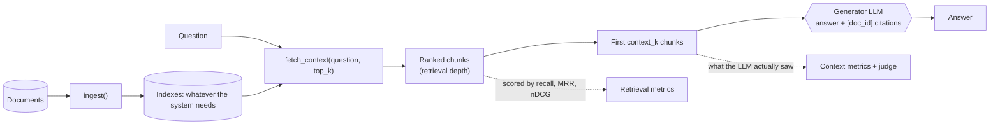

Three ideas run through everything below.

**Depth is not context.** `fetch_context` returns a ranking as deep as the largest `k` in `evaluation.k_values`, and retrieval metrics are measured on all of it. The generator only reads the first `context_k` chunks (the system's own `top_k` if it sets one). That is why a system can have a good Recall@10 and a poor answer: the evidence may sit at rank 7, outside the prompt. Two systems break the pattern on purpose: `full_context` reads everything that fits, and `parent_doc` counts depth in parents.

**Everything is a step.** While a question runs, the system records `Step`s in a per-question `Tracer`: `retrieve`, `rerank`, `llm`, `tool`, `embed`, `route`, `grade`, `generate`. Each carries latency, tokens and cost, and the costs add up to the answer's cost (a visible `untracked` step appears if they do not). The "Trace" lines below name the steps each system writes, so you can read a row of `per_question_results.jsonl` and see what happened.

**Cost is booked by purpose.** LLM spend inside retrieval is booked as `query_rewrite_cost`, reranker spend as `rerank_cost`, tool spend as `tool_cost`, and ingestion work (embeddings, LLM enrichment) is reported separately from per-question cost. [methodology.md](methodology.md#cost-accounting) explains why cache hits are still charged at standalone prices.

Three pieces of plumbing appear in many systems, so they are described once:

- **Reciprocal Rank Fusion (RRF)** merges several rankings into one without comparing their scores (BM25 scores and cosine similarities are not comparable). A chunk's fused score is the sum over rankings of `weight / (rrf_k + rank)`; the best fused scores win. A chunk that several rankings agree on rises, and one strong ranking cannot be drowned out by a weak one's score scale. `rrf_k` (default in [systems.md](systems.md#hybrid)) softens how much rank 1 beats rank 5.
- **Mock mode** (`--mock`, or no API key) swaps in hashing embeddings (every token hashed into a 384-dimension signed bucket, then normalised) and a deterministic mock LLM that recognises each prompt by a marker phrase and answers by simple rules. It exercises every code path, trace and budget without cost, but its answers are not evidence about quality.
- **Graceful degradation.** Wherever an LLM's JSON reply is needed (a plan, a grade, a route), the parser tolerates code fences and surrounding prose, and an unusable reply falls back to something safe (the original question, the default route, "keep the ranking as it is") and flags the step `fallback: true` instead of failing the question.

## Chunkers

A chunk is the unit that gets indexed and retrieved, so the chunker decides what a "hit" can even be. Every chunker only answers one question, *where are the character spans?*; the shared base class turns spans into chunks, which gives all of them the same guarantees: no empty chunks, `start_char`/`end_char` that reproduce the text, consecutive `chunk_index`, deterministic ids, and a PDF `page` copied into the metadata. `prefix_title` prepends the document title to each chunk's text so it is embedded and searched with it.

Sizes are in **tokens** for `token`, `recursive`, `sentence`, `semantic` and `markdown` (real `o200k_base` tokens through tiktoken, or a deterministic approximation with a warning when its vocabulary cannot be downloaded), in **words** for `word`, and in **characters** for `fixed_char`. Options: [systems.md](systems.md#chunker-options).

### `fixed_char`, `word`, `token`: sliding windows

The simplest family: slide a window of `chunk_size` units along the document, advancing by `chunk_size − chunk_overlap`.

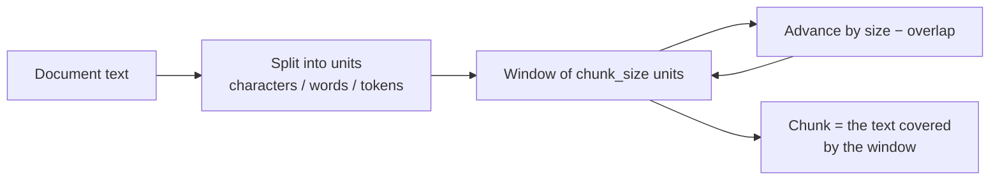

They ignore sentences and structure, so they cut mid-sentence, but they are predictable, fast and need nothing extra. `word` is what `token` meant before 0.3.0 (kept so old results stay comparable); `token` measures in the units a model actually pays for, which matters for code, numbers and non-English text.

### `recursive`: prefer natural breaks

Split at the largest natural boundary that makes pieces fit, and only fall back to a smaller one when needed.

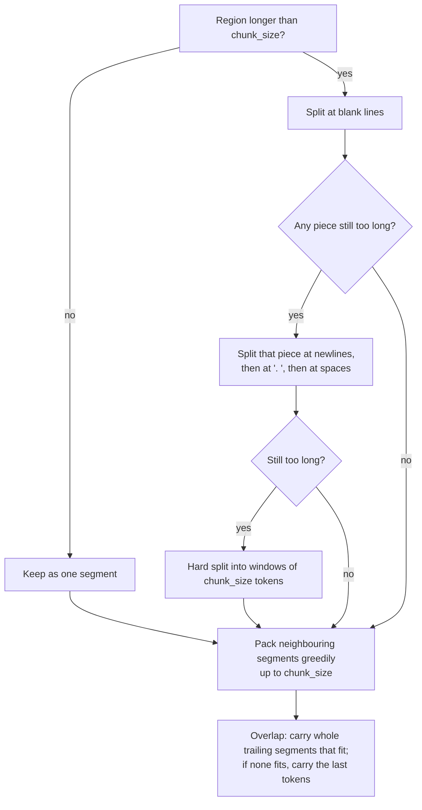

Chunks end at paragraph and sentence boundaries where possible, so a chunk is more likely to be a complete thought. `min_chunk_size` folds tiny leftovers into a neighbour.

### `sentence`: whole sentences, overlap counted in sentences

A regex splitter finds sentence ends (`.`, `!`, `?` followed by a sentence opener, CJK punctuation, blank lines). A sentence longer than `chunk_size` is split by tokens so it cannot overflow. Sentences are then packed up to `chunk_size`, and `chunk_overlap` here means *how many sentences* repeat at the start of the next chunk (default 1).

### `semantic`: split where the topic moves

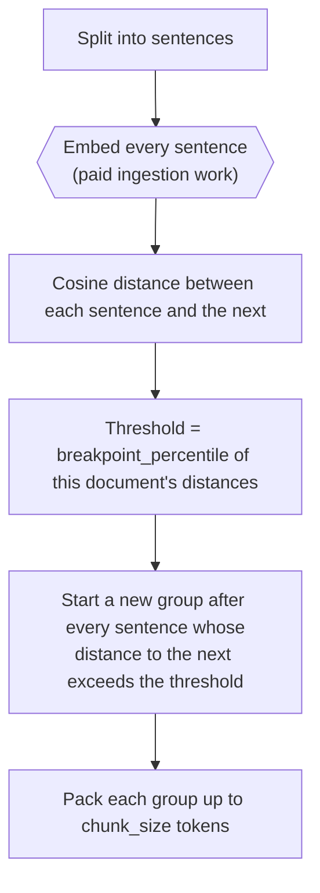

Boundaries adapt to each document: a document with one abrupt topic change splits there; a uniform document splits where the relative drift is largest. Documents with fewer than three sentences are not split. It is the only chunker that costs money at ingestion, and that cost is charged to the system's ingestion cost.

### `markdown`: one chunk per section

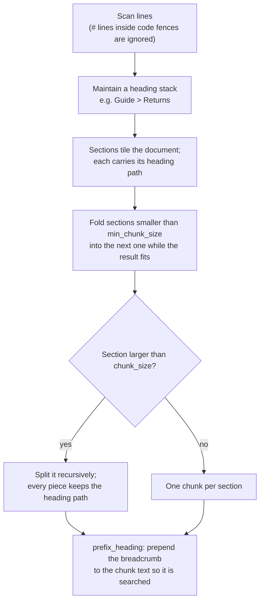

Use it for documentation, policies and handbooks: the section is the natural answer unit, and the breadcrumb lets a chunk say *where* it lives ("Returns > Refund window") even when its own sentences never repeat the topic.

## Retrieval building blocks

### BM25 (lexical)

Chunks are tokenised and scored with Okapi BM25: a term counts more when it is rare in the corpus (inverse document frequency) and when it appears often in the chunk, with diminishing returns and a length normalisation so long chunks do not win by volume. Only chunks that share at least one term with the question are returned (BM25's IDF can be zero for a term in half the corpus, so a score alone cannot tell "no overlap" from "unhelpful term"). It needs no embeddings, costs nothing per question, and is unbeatable for exact identifiers, error codes and rare names; it is blind to paraphrase.

### Dense vector search

Each chunk is embedded once at ingestion; the question is embedded per query; chunks are ranked by cosine similarity (vectors are unit length, so a dot product). The index behind that is pluggable:

| Backend | Search | Notes |
| --- | --- | --- |
| numpy | exact, brute force | the default; no extra dependency; deterministic |
| faiss | exact (flat inner product) | `ragbench[faiss]` |
| faiss_hnsw | approximate (HNSW graph) | faster on large corpora at some recall cost; `ragbench[faiss]` |
| chroma | approximate (HNSW) | `ragbench[chroma]`; not deterministic across processes |
| qdrant | exact, local mode | `ragbench[qdrant]`; one open client per directory |

A missing library is an error, never a silent fallback to another backend, so `vector_backend` in the retrieval metadata is always what ran. Query embeddings are never cached for latency measurement.

### MMR (maximal marginal relevance)

An option on `vector` and `hybrid` (`diversity: mmr`). A plain top-k can be five near-copies of the same passage. MMR takes a candidate pool (`mmr_candidates`) and picks greedily:

```text
next pick = argmax over remaining candidates of
            λ · relevance  −  (1 − λ) · (highest cosine similarity to any chunk already picked)
```

`relevance` is the retrieval score scaled so the best candidate is 1. At `λ = 1` the penalty vanishes and you get the plain ranking back; at `λ = 0` it only avoids repeats. It helps on corpora with near-duplicate documents and hurts when the answer genuinely needs several similar passages.

### Rerankers

A reranker takes the candidates a first stage found and reorders them with a more careful (and more expensive) judgement, keeping the best `top_k`. Every reranked chunk records its `original_rank`.

| Reranker | How it scores | Cost |
| --- | --- | --- |
| `simple_keyword_overlap` | number of distinct question words (longer than 2 letters) present in the chunk; the first-stage rank and score only break ties | free |
| `local_relevance` | TF-IDF (1–2 word n-grams, English stop words) fitted on the question plus the candidates, cosine to the question, plus a quarter of the fraction of question words covered, plus a small bonus for a good first-stage rank; falls back to keyword overlap if it fails | free |
| `cross_encoder` | a Hugging Face cross-encoder reads each (question, chunk) pair *together* and outputs a relevance score; the model is loaded once per process and shared; in mock runs it is replaced by `local_relevance` so nothing is downloaded | $0, but the most latency; needs `ragbench[rerank]` |
| `llm` | one call shows the model every candidate and asks for the ids of the most useful ones in order; an unusable reply falls back to `local_relevance` | one LLM call per question |

The cross-encoder is the real quality step: a bi-encoder (the embedding search) compares two independently computed vectors, while a cross-encoder lets the question and the passage attend to each other, which catches negation, qualifiers and entity mismatches.

### Documents, tools, caches

Loading (`.txt .md .rst .html .pdf .docx .csv .tsv .json .jsonl`, with ignore rules and encoding fallbacks) is described in [dataset-format.md](dataset-format.md). Tool details are in [tools.md](tools.md); the parts agents rely on are summarised next.

## Agent building blocks

### The agent loop

`corrective` and `iterative` are written as a **policy** run by a bounded controller, `AgentLoop`. The policy does the work of one iteration (search, grade, rewrite, ...) and returns what to do next; the loop owns the stopping rules.

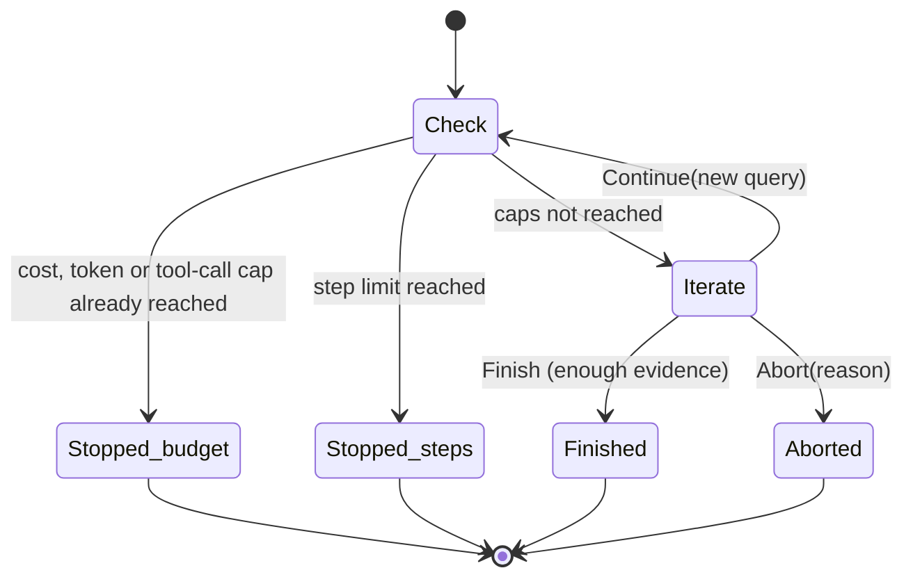

- The loop **never raises** because a budget ran out. It records a termination (`finished`, `budget`, `max_steps` or `abort`) in `answer.metadata["agent"]`, and the caller answers from the evidence gathered so far. The answer call itself is always made, so a question can end slightly over a cost cap by that one call.
- A hard ceiling on iterations holds whatever the policy does, and a policy that returns something that is not an action aborts instead of looping forever.
- The caps (`max_cost_usd`, `max_tokens`, and for tool agents `max_tool_calls`) cover everything the question has used so far, measured from its trace. Before every extra LLM call a policy makes, it asks whether the budget is spent.
- Each decision (continue, finish, abort, stop) is a zero-cost `route` step named `agent_decision` or `agent_stop`, so the trace shows why the loop ended.

### Tool calling and the tool box

Tool agents (`agent_search`, `grep_agent`) talk to the model through one normalised interface. Two protocols exist: `native` uses the provider's function calling, and `react_json` describes the tools in the prompt and parses one JSON action per reply, for models without function calling (it tolerates code fences, prose around the JSON, and the usual variants of the key names).

Every call goes through the `ToolBox`, which guarantees: an unknown tool or bad arguments come back as an *error observation* the model can recover from (the loop continues); each call has a timeout and runs in its own thread; output is capped; a tool exception never propagates; and every call is a `tool` step with its arguments, output, latency and cost. The built-ins are deliberately safe: `calculator` walks a whitelisted syntax tree (there is no `eval`, exponents and result sizes are capped), `date_calc` uses a `today` frozen for the whole run so results are reproducible, and `corpus_grep` bounds regex length and line length so a hostile pattern cannot hang a run.

## The systems

Systems are grouped by the idea they test. Each section gives the idea, what happens at ingestion and per question, and what to watch for. Links in each heading's last line go to the option reference.

### Baselines: how much does retrieval help at all?

#### `no_retrieval`

**Idea.** The floor. The model answers from its own knowledge with no documents, and a prompt telling it to say so rather than invent names, numbers or identifiers.

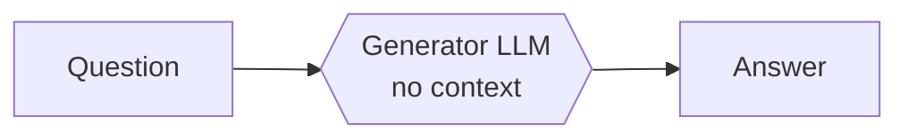

**Ingestion:** nothing. **Per question:** one generation call. Retrieval columns (recall, MRR, nDCG) are blank in every report, never 0, because nothing was retrieved.

**Use it** to prove retrieval is earning its keep, and to see how often the model answers confidently without the documents (a high faithfulness-failure count here is the hallucination baseline for your domain). On a public-knowledge corpus it can score embarrassingly well, which is itself a finding: your questions may not need your documents. Options: [systems.md](systems.md#no_retrieval).

#### `full_context`

**Idea.** The ceiling for small corpora. Skip retrieval and put whole documents in the prompt.

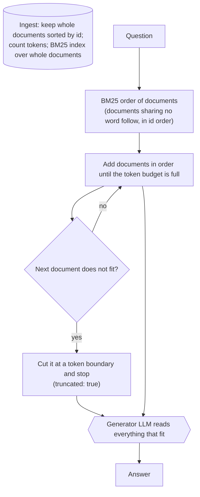

**Details.** One "chunk" per document, so retrieval metrics are document rankings. The generator is given *all* the included documents (not only the first `context_k`); `top_k` only sets how deep the metric ranking goes. You pay for every token you put in, which is the point: the report's cost column shows what "just read everything" costs against a retrieval pipeline.

**Watch out.** When the corpus does not fit the budget, what is dropped is decided by BM25 alone. Very long contexts can also dilute the model's attention ("lost in the middle"), so a retrieval pipeline occasionally beats it. Options: [systems.md](systems.md#full_context).

### Lexical and dense retrieval

#### `bm25`

**Idea.** Lexical search over chunks. **Ingestion:** chunk, build the BM25 index. **Per question:** score every chunk, return the best `top_k`. No embeddings, no LLM besides generation.

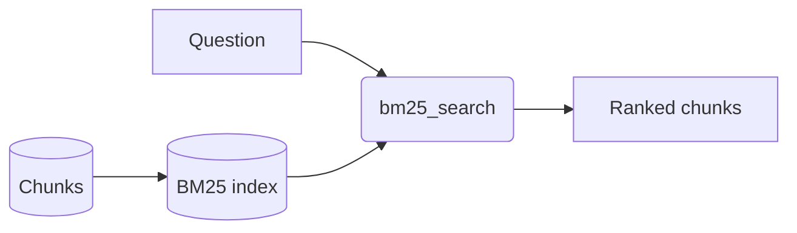

**Strengths:** exact identifiers, product codes, rare names, near-zero cost. **Weakness:** vocabulary mismatch ("refund window" vs "return period"). It is the cheapest baseline and, on keyword-rich corpora, often statistically tied with systems that cost ten times more. Options: [systems.md](systems.md#bm25).

#### `vector`

**Idea.** Semantic search: embed chunks, embed the question, rank by cosine similarity. **Per question:** one query embedding, then the index search. With `diversity: mmr` the retrieved candidate pool is re-ranked as described under [MMR](#mmr-maximal-marginal-relevance).

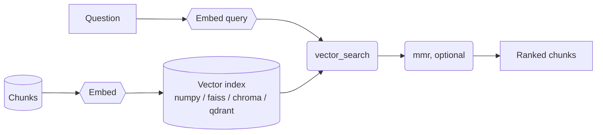

**Strengths:** paraphrase and meaning. **Weaknesses:** exact strings, numbers and rare tokens can be diluted into a vector; short ambiguous questions embed poorly (see `hyde`). Options: [systems.md](systems.md#vector).

### Fusion and reranking

#### `hybrid`

**Idea.** Run BM25 and vector search and fuse the two rankings with weighted RRF, so a chunk found by either (or both) rises.

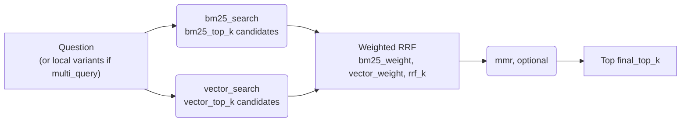

**Details.** Both searches run to a depth of at least the retrieval depth. `bm25_weight` and `vector_weight` bias the fusion towards lexical or semantic evidence. `multi_query` replaces the single question by a few **local, rule-based** variants (comparison sides, `and what ...` clauses, salient capitalised phrases; no LLM) and fuses all of those rankings too: a cheap help for multi-hop questions. This is the retrieval backbone that `contextual`, `rag_fusion`, `decompose`, `corrective`, `iterative` and `agent_search` build on.

**Why it usually wins the cheap tier:** the two retrievers fail on different questions, and RRF needs no score calibration. Options: [systems.md](systems.md#hybrid).

#### `hybrid_rerank`

**Idea.** Use hybrid retrieval for **recall** (cast a wide net), then a reranker for **precision** (pick the best few).

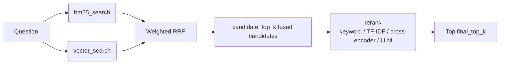

**Details.** The reranker sees `candidate_top_k` chunks (wider than the final list) and returns the best few. Which reranker you choose sets the cost and latency: TF-IDF is free and fast, a cross-encoder is free but slower on CPU, `llm` adds one call per question. **Watch out:** a reranker can only promote what the first stage retrieved, so raise `candidate_top_k` before blaming the reranker. Options: [systems.md](systems.md#hybrid_rerank).

#### `rerank`

**Idea.** The same two-stage pattern with plain vector search as the first stage. Candidates from the question (and, with `multi_query`, its local variants) are merged by their best score, then reranked.

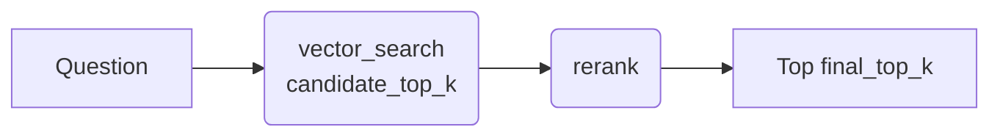

Use it to isolate the reranker's contribution against `vector`, and `hybrid_rerank` to see what the lexical half adds on top. Options: [systems.md](systems.md#rerank).

### Shaping what the generator reads

#### `parent_doc`

**Idea.** Small chunks match precisely; large chunks answer completely. Search the small ones, hand over their larger parents.

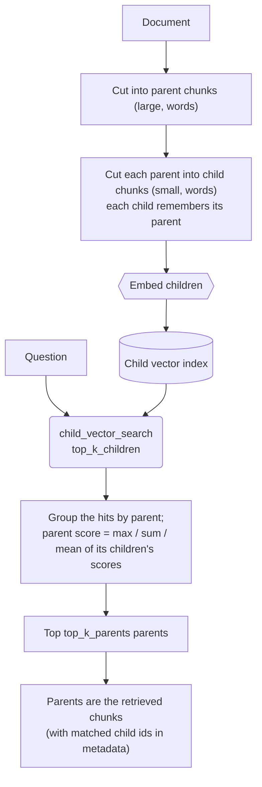

**Details.** Only children are embedded; parents are looked up by id. `parent_score_aggregation` decides how child evidence rolls up: `max` trusts the single best match, `sum` rewards a parent hit by several children (a topic spread over the section), `mean` rewards consistently relevant parents. Asking for a deeper ranking automatically searches enough children to cover that many distinct parents. Chunking is by words (it has its own `parent_chunk_size` and `child_chunk_size` options, not the shared `chunker:`).

**Strengths:** the answer's surrounding context is intact. **Watch out:** parents cost more prompt tokens, and a big parent can bury the answer sentence. Options: [systems.md](systems.md#parent_doc).

#### `sentence_window`

**Idea.** The finest-grained index: single sentences. Match a sentence precisely, then give the generator the sentence plus its neighbours.

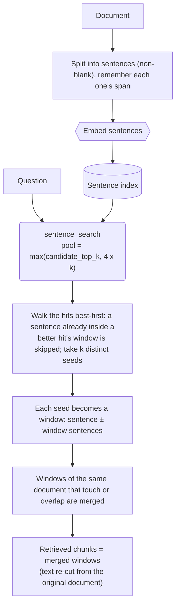

**Details.** Windows are cut from the original document text, so what the generator reads is verbatim. Skipping hits inside an existing window means the `k` results are `k` distinct places, not one passage repeated. Lower-ranked sentences never widen an existing window; only overlap does.

**Strengths:** pinpoint matches in long, dense documents. **Watch out:** a sentence that only makes sense with its paragraph ("It must be filed within 30 days") embeds poorly on its own; a larger `window` helps the reader, not the matcher. `contextual` attacks that problem at ingestion instead. Options: [systems.md](systems.md#sentence_window).

### LLM query strategies: improve the question before searching

These three keep the plain index and spend LLM calls on the *query*. In all of them a bad or unreadable LLM reply falls back to searching the original question.

#### `hyde`

**Idea (HyDE, Hypothetical Document Embeddings).** A terse question and a passage that answers it live in different parts of embedding space. So have the LLM write a short hypothetical answer, and search with *that*.

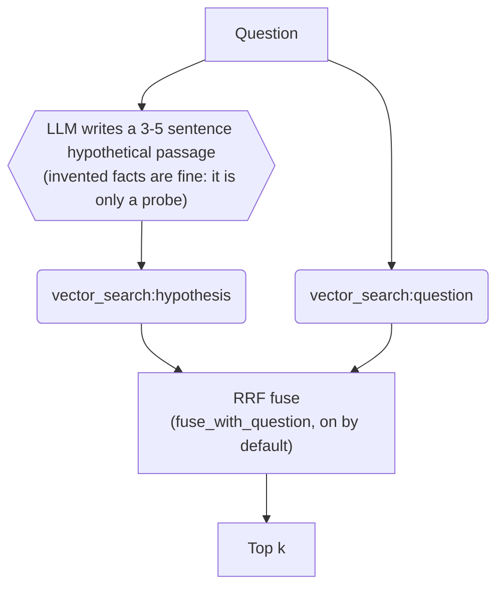

**Details.** The hypothetical text is never shown to the generator, only embedded. Fusing with the raw-question ranking is a safety net: if the model hallucinates a misleading passage, the real question still votes. Its text is stored in `retrieval.metadata["hypothetical_document"]`, which is the first place to look when HyDE retrieves something odd.

**Strengths:** vague or very short questions. **Weakness:** the model can confidently invent a plausible but wrong passage and pull the search away; it costs one extra LLM call and its latency on every question. Options: [systems.md](systems.md#hyde).

#### `rag_fusion`

**Idea (RAG-Fusion).** Ask the LLM for several differently worded queries; a chunk that many wordings agree on is probably relevant.

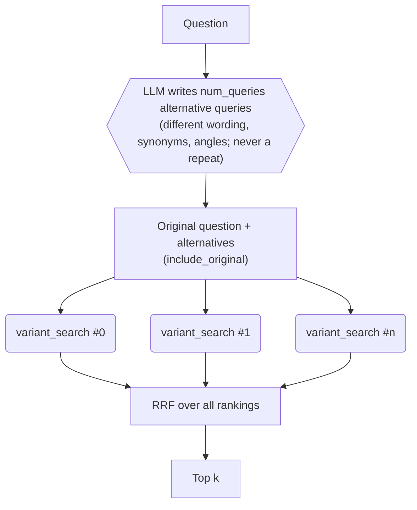

**Details.** Each variant is searched with the configured retriever (`hybrid` or `vector`). This differs from `multi_query` on `hybrid` in where the variants come from: here an LLM, there local rules. If the plan is unusable, only the original question is searched (the step is flagged `fallback`).

**Strengths:** questions worded unlike the documents. **Watch out:** variants can drift off topic, and you pay for N searches plus a planning call. Options: [systems.md](systems.md#rag_fusion).

#### `decompose`

**Idea.** A question with several parts is hard for one search, because no single passage answers it. Split it, search each part, and answer from all the evidence.

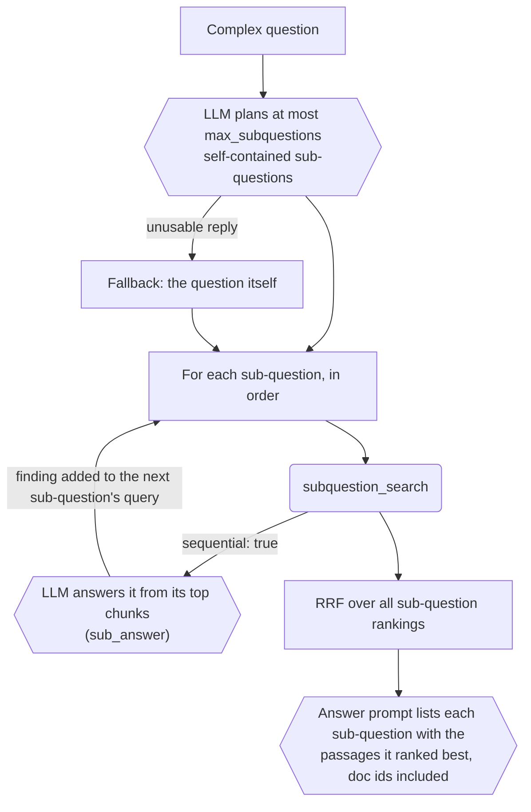

**Details.**
- **Independent mode** (default): every sub-question is searched on its own; cost is one planning call plus the searches.
- **Sequential mode**: for questions whose later parts depend on earlier answers ("Who leads the team that owns X, and where are they based?"). Each sub-question is answered from its own evidence, the finding (trimmed) is appended to the next sub-question's search query, and the findings are shown to the final answer as *preliminary*, not as evidence. Costs one extra LLM call per sub-question.
- `include_original` also searches the original question, as insurance against a bad split.
- The final prompt groups evidence by sub-question (a passage appears under the sub-question it ranked highest for), which makes multi-document citations easy for the model. When nothing was split, the plain answer prompt is used.

**Strengths:** comparisons, multi-part and multi-hop questions. **Watch out:** on simple questions it is pure overhead; a poor split loses the thread. Options: [systems.md](systems.md#decompose).

### LLM work at ingestion: spend once, search better forever

These systems pay LLM costs while indexing and almost nothing extra per question. Because those ingestion calls are made at temperature 0, they are cached on disk, so re-runs are nearly free. If an individual call fails, that item degrades gracefully (no context, a lead-text summary) and is counted in the ingestion metadata; only when every call fails does the run stop with the first error, since that means a bad key or model name.

#### `contextual`

**Idea (Contextual Retrieval).** A chunk like "Revenue grew 12% over the previous quarter." is useless on its own: which company, which quarter? Have an LLM write a one-or-two-sentence *situating context* for each chunk from its document, and index the context together with the chunk.

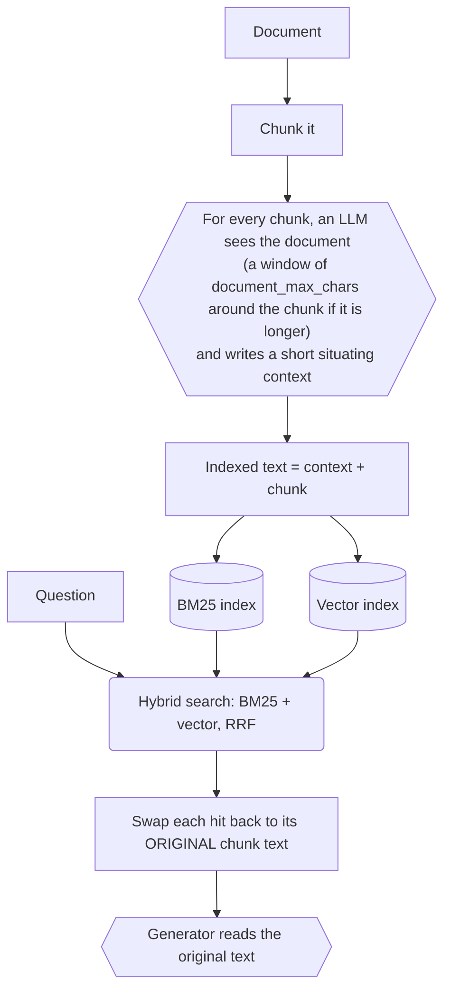

**Details.** The context is prepended before embedding **and** before BM25 indexing, so both halves of the hybrid search can match a chunk on what its *document* is about, not only its own words. Retrieval happens exactly like `hybrid` (all its retrieval options apply), but the chunks handed to the generator and judge are the original text, so the context steers the search without polluting the answer or the citations.

**Strengths:** corpora full of near-identical documents, pronouns and section-relative facts. **Costs:** one LLM call per chunk, each carrying the document excerpt, so ingestion is the expense (`document_max_chars` controls it). Options: [systems.md](systems.md#contextual).

#### `hierarchical`

**Idea.** First decide *which documents*, then search *inside* them. Good for "which document says...?" questions and for corpora too large to scan chunk by chunk.

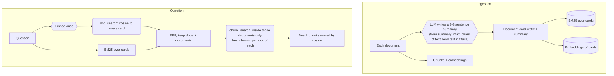

**Details.** The first stage is a *routing* decision over a small set of cards; the second stage ranks chunks only within the routed documents (each chunk records `routed_doc_rank`). Search is exact NumPy, so this system takes no `vector_store` option. The question is embedded once for both stages.

**Strengths:** big corpora (the chunk search covers `docs_k × chunks_per_doc` candidates instead of everything), and questions about *which* document. **Watch out:** if routing misses the right document, nothing downstream can recover it; summaries that omit the detail you ask about make that likelier. Options: [systems.md](systems.md#hierarchical).

#### `llm_heavy`

**Idea.** Three independent LLM features around a vector index: enrich chunks at ingestion, rewrite the question into several queries, rerank with an LLM. Each is a switch under `llm_features`, so this one system lets you measure each feature's marginal value.

```mermaid
flowchart TD
    subgraph Ingestion
        C["Chunk"] --> EN{{"enable_llm_ingestion:<br/>LLM writes summary, key entities,<br/>hypothetical questions"}}
        EN --> AUG["Indexed text = chunk + summary + entities + questions<br/>(original text kept in metadata)"]
        AUG --> VI[("Vector index")]
    end
    subgraph Question
        Q["Question"] --> RW{{"enable_query_rewrite:<br/>LLM writes 3-5 search queries"}}
        RW --> VS("vector_search per query")
        VS --> MG["Merge by best score per chunk,<br/>swap in original chunk text"]
        MG --> RR("rerank: LLM if enable_llm_rerank,<br/>else the reranker option")
        RR --> R["Top k"]
    end
```

**Details.** Unlike the RRF systems, the per-query rankings are merged by taking each chunk's *best* cosine score (all queries search the same index, so the scores are comparable). Ingestion enrichment is optional and off by default because it is the costly part: one call per chunk, run in parallel (`ingest_workers`). Hypothetical questions in the indexed text make a chunk match the way a user would phrase a question about it.

**Use it** as the "throw LLMs at everything" ceiling for your corpus; compare it to cheaper systems before adopting it. Options: [systems.md](systems.md#llm_heavy).

### Agentic systems that loop

Both of these are `AgenticRAG` systems: they index like `hybrid`, and the control logic is an [`AgentLoop`](#the-agent-loop) policy. Each of their control calls (grade, rewrite, next-hop) is a traced JSON-mode LLM call booked as query-rewrite cost, and the retrieval cost reported for the question is everything the agent spent. The `agent` block in each answer's metadata reports `steps`, `hops`, `termination`, `budget_exhausted` and `llm_calls`.

#### `corrective`

**Idea (Corrective RAG).** Do not answer from a bad context. Retrieve, have the LLM *grade* what came back, and if too little is relevant, rewrite the query and widen the search before answering. Optionally check the final answer against its context.

```mermaid
flowchart TD
    Q["Question"] --> R1("round_search<br/>(hybrid or vector)")
    R1 --> GR{{"grade_chunks: one call grades the top<br/>grade_top_k chunks<br/>relevant / ambiguous / irrelevant"}}
    GR -->|"unparseable"| KEEP["Keep the ranking as it is, stop"]
    GR --> ENOUGH{"relevant chunks >= min_relevant?"}
    ENOUGH -->|yes| FIN["Finish"]
    ENOUGH -->|"no, and retries left (max_rounds)"| RW{{"rewrite_query: new wording naming<br/>the missing entities and facts"}}
    RW -->|"repeats an earlier query"| FIN
    RW --> WIDE["Retry search, widened by expand_to:<br/>hybrid at 2x depth / add whole top documents / rewrite only"]
    WIDE --> GR
    FIN --> RANK["Final order: relevant, ambiguous, ungraded, irrelevant<br/>(grades act as a reranker)"]
    KEEP --> RANK
    RANK --> ANS{{"Generate answer"}}
    ANS --> SC{"self_check on?"}
    SC -->|yes| CK{{"groundedness: is every claim supported by the context?"}}
    CK -->|"unsupported claims"| RG{{"Regenerate once, told what was unsupported"}}
```

**Details.**
- A chunk graded in several rounds keeps its **best** grade. Retries grade more chunks than the first round (twice as many for `hybrid`, three times for `full_doc`).
- `expand_to: full_doc` handles "right document, wrong chunk": the whole text of the two best documents' chunks joins the candidates.
- It stops early, and says why in the metadata, when the grader's reply cannot be parsed, when a rewrite repeats an earlier query, or when a cost or token cap is reached. `max_rounds: 0` means grade and reorder only, never retry.
- The self-check costs one extra call, plus a second generation when the draft contains unsupported claims; it is skipped when the budget is spent.

**Strengths:** corpora where the first search often misses, and where an honest "not found" beats a confident wrong answer. **Watch out:** grading adds an LLM call to *every* question, including the many that were fine; and an LLM grader can mark a partially relevant chunk irrelevant and trigger needless retries. Options: [systems.md](systems.md#corrective).

#### `iterative`

**Idea (IRCoT-style multi-hop).** Some answers cannot be searched for up front because the second query depends on what the first search *found* ("Which team owns the service that failed? Who manages that team?"). So alternate retrieval and reasoning.

```mermaid
flowchart TD
    Q["Question"] --> H1("hop_search with the current query")
    H1 --> EV["Evidence = the top chunks_per_hop of every round so far"]
    EV --> NH{{"next_hop: LLM states what is known,<br/>what is still missing,<br/>and the next query - or DONE"}}
    NH -->|"DONE"| FIN["Finish"]
    NH -->|"repeats an earlier query"| FIN
    NH -->|"unparseable"| FIN
    NH -->|"new query, hops left (max_hops)"| H1
    FIN --> MG["RRF over every round's ranking"]
    MG --> ANS{{"Answer from the merged evidence,<br/>plus the LLM's notes (marked as not evidence)"}}
```

**Details.** Retrieval is scored on the merged ranking of all rounds. The model's per-round `known` / `missing` notes are saved in the retrieval metadata (`notes`) and shown to the answer prompt, but labelled as notes, so the answer still has to rest on retrieved text. If the budget is spent before the first round completes, the question is searched once anyway.

**Compared with `decompose`:** `decompose` plans every sub-question up front (cheaper, parallelisable, but cannot use what the first search discovers unless `sequential` is on); `iterative` plans one hop at a time from the evidence in hand (more LLM calls, truly adaptive). **Strengths:** genuine multi-hop chains. **Watch out:** one `next_hop` call per round on every question, even ones answerable in one hop. Options: [systems.md](systems.md#iterative).

### Agentic systems that call tools

`agent_search` and `grep_agent` share the `ToolAgent` driver: the model decides, turn by turn, which tool to call, reads the observation, and eventually answers. Their mechanics are identical; they differ in *which tools* the model gets.

```mermaid
flowchart TD
    Q["Question + system prompt:<br/>use tools, cite [doc_id], say so if not found"] --> T{{"agent_turn: model call<br/>(native function calling or react_json)"}}
    T -->|"tool call(s)"| TB["ToolBox runs each call:<br/>timeout, output cap, never raises"]
    TB --> OBS["Observation text goes back to the model"]
    OBS --> CAP{"Caps left?<br/>steps, cost, tokens, tool calls"}
    CAP -->|yes| T
    CAP -->|"no: budget / step limit"| FORCE{{"Forced best-effort answer<br/>from what the tools returned"}}
    T -->|"text with no tool call"| ANS["That turn is the answer<br/>(recorded as the generate step)"]
    TB -. "evidence-producing calls" .-> EVD["One ranking per search / grep / read call"]
    EVD --> RRF["RRF -> the ranking that retrieval metrics score"]
```

**Details common to both.**
- The final answering turn is relabelled as the `generate` step, so cost-by-stage shows agent *thinking* turns as `llm` and the answer as `generate`.
- **Retrieval is scored on what the tools put in front of the model**: search hits, grep matches and document windows each become a ranking, and the rankings are merged with RRF. A system that never searched has an empty ranking.
- A call past `max_tool_calls` is refused with a message telling the model to answer; an unknown tool name becomes an error observation (counted as `unknown_tool_calls`); in `react_json` mode a reply that is not an action is taken as a prose answer.
- Each question gets its own tool context, so concurrent questions share nothing mutable.
- If the loop ends without a model-written answer, the agent is asked once more to answer from what it has, and the run is flagged `best_effort`.

#### `agent_search`

**Idea.** A function-calling agent whose main tool is `search`, the *same* hybrid or vector retrieval the plain systems use, plus whatever is in its `tools:` list. The agent decides when to search, when to compute, and when to grep.

The `search` tool is always present; the benchmark question is what the *other* tools are worth. That is why `configs/all.yaml` includes two variants (`tools: []` against `tools: [calculator, date_calc, corpus_grep]`): the report then shows the gain on questions that need arithmetic or date reasoning against the extra cost and latency. **Strengths:** computation ("by how much did...", "how many days between..."), exact lookups, questions needing several searches. **Watch out:** the most expensive and slowest family; for a pure lookup corpus the agent's extra turns buy nothing. Options and the tool list: [systems.md](systems.md#agent_search), [tools.md](tools.md).

#### `grep_agent`

**Idea.** The index-free architecture: no chunking, no embeddings, no vector store. The agent can only `list_documents`, `corpus_grep` and `read_document`, and works like a person with a terminal.

```mermaid
flowchart LR
    Q["Question"] --> L("list_documents: what exists")
    L --> G("corpus_grep: where do these words or identifiers occur")
    G --> RD("read_document: read a window around a hit,<br/>move start to continue")
    RD --> G
    RD --> A["Cited answer"]
```

**Details.** Ingestion is free and instant (it only holds the documents). Everything is paid per question, in agent turns. `corpus_grep` matches by default when *every* word of the pattern is on one line (case-insensitive), or by a bounded regex, and returns lines with context.

**Use it** as the "do I need retrieval infrastructure at all?" test. On a small, exact-match-heavy corpus it can match indexed systems with zero index; as the corpus grows, or when questions are paraphrased so no grep pattern finds them, it falls behind and its per-question cost climbs. Options: [systems.md](systems.md#grep_agent).

### Routing

#### `adaptive`

**Idea.** No single architecture wins every question, so choose per question. The system holds several complete pipelines (`routes:`) and sends each question to the one best suited to it.

```mermaid
flowchart TD
    Q["Question"] --> RT{"router"}
    RT -->|"heuristic: free, rule-based"| H["First matching role that is configured"]
    RT -->|"llm: one short call"| L{{"Model picks a route name<br/>from the route descriptions"}}
    H --> CH
    L --> CH["Chosen route"]
    CH --> LEX["lexical<br/>e.g. a bm25 pipeline"]
    CH --> COMP["computation<br/>e.g. a tool agent"]
    CH --> MH["multi_hop<br/>e.g. decompose"]
    CH --> DEF["default<br/>the general pipeline"]
    LEX & COMP & MH & DEF --> OUT["That pipeline answers;<br/>its steps join this question's trace, tagged with the route"]
```

**The heuristic router** tests three roles in a fixed order and takes the first that matches *and* is configured; otherwise `default`:

1. **`lexical`**: the question contains an exact identifier or phrase: codes like `HS-4127`, `INV_2024`, `AB1234`, UUIDs, version numbers like `2.1.3`, or a quoted phrase or code span.
2. **`computation`**: date arithmetic wording ("how many days between"), several figures plus words like total, percent or average, percentage or ratio wording, a figure to scale into a cost, or a total over quantities. Years alone do not count as figures.
3. **`multi_hop`**: comparison wording (compare, versus, difference between, both, and then), or several linked parts (a second `and what/which/who...` clause, or more than one question mark).

**The LLM router** is shown a description of every route (a built-in description for the known roles, or your own in `route_descriptions`, which also allows route names of your own) and answers with a route and a reason. A missing or unknown choice falls back to `default` and the step is flagged `fallback`.

**Details.** Each route is a full system built from its own inline config, ingested once; routes inherit the adaptive system's models unless they set their own, and routes with the same chunker and embedding model share corpus embeddings through the run's cache (each is still *charged* at standalone prices). Configuration mistakes (an unknown route type, bad options) fail when the config loads, not at question 37. Whether routing pays is visible in `routes.csv`: how many questions each route took and how they scored.

**Watch out:** adaptive is only as good as its routes and its router. It costs the *sum* of its routes' ingestion; a heuristic misroute sends a question to a pipeline that cannot answer it. Options: [systems.md](systems.md#adaptive).

## Where the LLM is called

A side-by-side view of what each system pays for and when. "Ingestion" calls happen once per run (and are disk-cached); "per question" calls happen for every question. Generation is the answer call every system makes except where noted. Cost and latency labels per system live in [systems.md](systems.md#overview).

| System | LLM calls at ingestion | LLM calls per question besides the answer | Retrieval side effects on the trace |
| --- | --- | --- | --- |
| [no_retrieval](#no_retrieval) | none | none | no retrieval step |
| [full_context](#full_context) | none | none | one `fill_context` step; very large prompt |
| [bm25](#bm25) | none | none | `bm25_search` |
| [vector](#vector) | embeddings | none | `vector_search`, optional `mmr` |
| [hybrid](#hybrid) | embeddings | none | `bm25_search` + `vector_search` per query, optional `mmr` |
| [hybrid_rerank](#hybrid_rerank) | embeddings | none (one if reranker is `llm`) | search steps + `rerank` |
| [rerank](#rerank) | embeddings | none (one if reranker is `llm`) | `vector_search` + `rerank` |
| [parent_doc](#parent_doc) | embeddings of children | none | `child_vector_search` |
| [sentence_window](#sentence_window) | embeddings of every sentence | none | `sentence_search` |
| [hyde](#hyde) | embeddings | one (hypothetical passage) | `hypothetical_document` (llm), two `vector_search` |
| [rag_fusion](#rag_fusion) | embeddings | one (query variants) | `query_variants` (llm), one `variant_search` per query |
| [decompose](#decompose) | embeddings | one plan, plus one per sub-question when sequential | `plan_subquestions`, `subquestion_search` per part, `sub_answer` |
| [contextual](#contextual) | one per chunk | none | like `hybrid` |
| [hierarchical](#hierarchical) | one per document | none | `doc_search`, `chunk_search` |
| [llm_heavy](#llm_heavy) | one per chunk if enabled | one rewrite; one rerank if enabled | `query_rewrite`, `vector_search` per query, `rerank` |
| [corrective](#corrective) | embeddings | one grade per round, one rewrite per retry, optional self-check | `round_search`, `grade_chunks`, `rewrite_query`, `groundedness` |
| [iterative](#iterative) | embeddings | one `next_hop` per round | `hop_search`, `next_hop` per round |
| [agent_search](#agent_search) | embeddings | one per agent turn | `agent_turn`, one `tool` step per call |
| [grep_agent](#grep_agent) | none | one per agent turn | `agent_turn`, `tool` steps |
| [adaptive](#adaptive) | the sum of its routes | one for the router if `llm` | `route_question` plus the chosen route's steps |

The cheap rows are not the weak ones: on the bundled demo most systems were statistically tied on answer quality, and the recommendation fell to cost and latency (see [methodology.md](methodology.md) for how ties are decided, and [choosing-an-architecture.md](choosing-an-architecture.md) for which of these to put in your own comparison).
